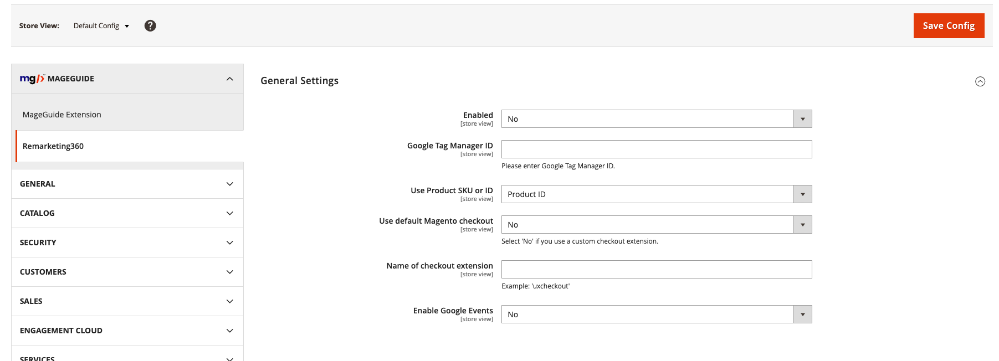
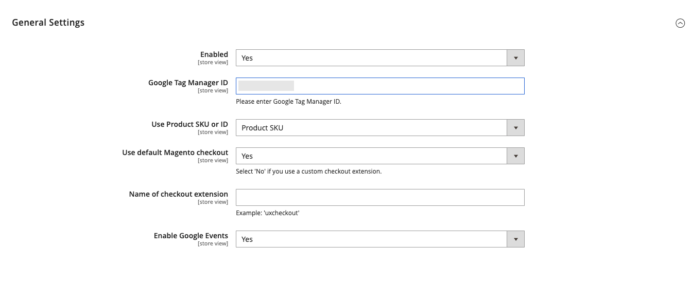

# MageGuide Remarketingthreesixty
Tested on: ```2.3+```

## Description
Adds Remarketing360, remarketing tags on each page.

## Functionalities 
- Provides admin settings for easy customization.
- Google Tag Manager Id can be entered from Magento backend.
- You can choose whether to display product's sku or product's id on remarketing tags.
- You can enable google events from the admin.

## Steps to setup
- Upload module files in `app/code/MageGuide`
- Install module
```
        $ php bin/magento module:enable MageGuide_Remarketingthreesixty
        $ php bin/magento setup:upgrade
        $ php bin/magento setup:di:compile
```
- To change general module settings go `Stores > Configuration > MageGuide > Remarketing360`. 

## Usage
Configuration settings in the admin:

- **Enabled** - Enable/Disable Module.
- **Google Tag Manager ID** - You can enter your Google Tag Manager Id.
- **Use Product SKU or ID** - Choose whether to display product's sku or product's id.
- **Use default Magento checkout** - Choose `Yes` if you are using the default magento checkout
- **Name of checkout extension** - If no, enter here the name of the checkout extension
- **Enable Google Events** - Enable/Disable Google events

## Screenshots

##### Stores Configuration Settings


##### This is an example with all the fields filled.

